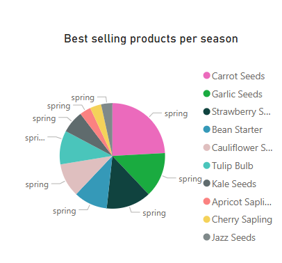
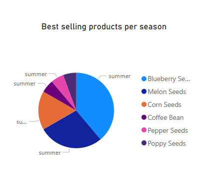
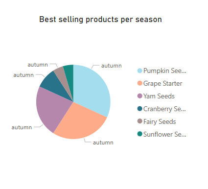
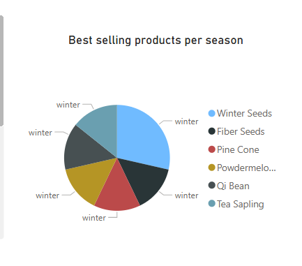
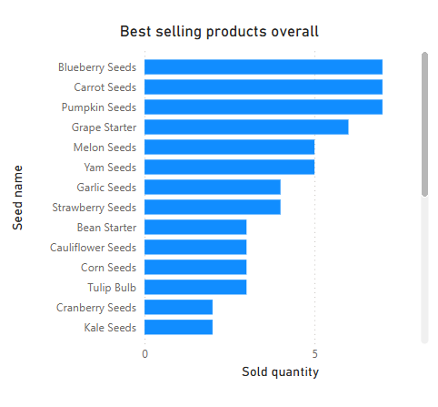
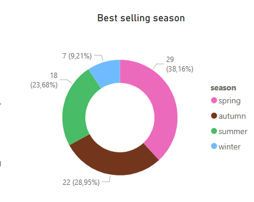

# Pierre's Shop – Data Analytics Dashboard (Part 2)

This is **Part 2** of the *Pierre's Shop* project, focusing on data analysis and visualization using **Python** for data processing and **Power BI** for building an interactive dashboard.  
Part 1 was a complete full stack web application for managing Pierre’s online store. Now, this stage brings business insights using real-time data from the store's API.

---

## 🧠 Project Overview

The goal of this project is to extract data from the store’s API, transform it using Python, and analyze it through visual storytelling with Power BI. This helps identify business trends like best-selling products, seasonal preferences, and customer behavior.

---

## ⚙️ Data Pipeline

The data pipeline is handled by a Python script that:
1. Connects to the store's RESTful API.
2. Fetches order and product data.
3. Matches orders to products.
4. Structures and cleans the dataset.
5. Exports everything into a clean Excel file (`complete_orders.xlsx`) for Power BI usage.

> 📁 The script is located at: `data_processing/data_process.py`

---

### 🛠️ Dependencies

This project relies on the following Python libraries:

- **`pandas`** – For powerful data manipulation and transformation.
- **`requests`** – To handle HTTP requests and retrieve real-time data from the API.
- **`openpyxl`** – Enables the creation of Excel files compatible with Power BI.

These tools work together to automate the transformation of raw API JSON data into a structured Excel dataset, ready for business analysis and visualization.

---

## 📊 Power BI Dashboard

The Power BI report contains multiple views and KPIs that help interpret the store's sales data.

### 🔹 Sales by Season
Visualizing total sales across Spring, Summer, Autumn, and Winter.

<div style="display: flex; flex-wrap: wrap; justify-content: space-between;">
  <div style="flex: 0 0 48%; margin-bottom: 10px;">
    
  </div>
  <div style="flex: 0 0 48%; margin-bottom: 10px;">
    
  </div>
  <div style="flex: 0 0 48%; margin-bottom: 10px;">
    
  </div>
  <div style="flex: 0 0 48%; margin-bottom: 10px;">
    
  </div>
</div>

---

### 🔹 Best Selling Overall Product  
The most sold product across all seasons, highlighting total sales volume.



---
### 🔹 Best Selling Season  
The season with the highest total sales, helping identify peak performance periods.



---

## 🚀 How to Run

1. Clone the repository.
2. Make sure you have Python and its libraries installed.
3. Run the data processing script:
   ```bash
   cd data_processing
   python data_process.py


